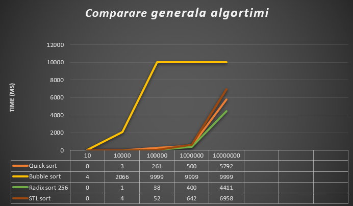
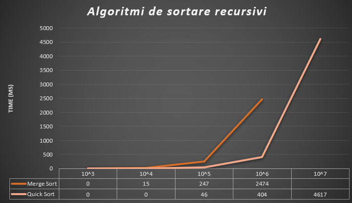
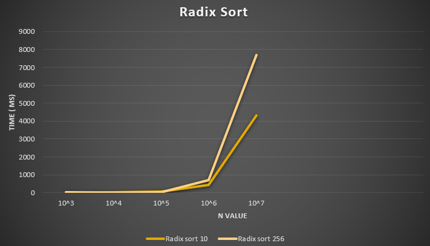

# Algoritmi de sortare

**Complexitate algoritmi:** 

- Bubble Sort: O(n^2)
- Merge sort, Quick sort O(n\*log n)
- Count Sort O (n+vmax) (vmax – valoarea maximă din vector)
- Radix Sort O((n+b) \* logb(vmax)) (n – numarul de elemente, b – baza radix sortului, vmax – valoarea maximă din vector)

 **Algoritmi de sortare recursivi:**

- Merge sort
- Quick sort

Desi au in general complexitate n\*log n (quick sortul poate ajunge la n2 pe cazul cel mai nefavorabil)

Pentru vectorii cu mai puțin de 10^5 elemente **nu există** diferențe semnificative între cei doi algoritmi, în ceea ce privește timpul;

Alegerea pivotului in mod aleatoriu la Quick Sort este mai eficenta decat alegerea primului sau a ultimului element, evitandu-se cazurile nefavorabile (cand este soratat crescator sau descrescator).

Merge Sort este mai lent decat Quick Sortul deoarece nu este &quot;in place&quot;, pierzand mai mult timp pentru a copia elementele. Aceste este mai putin eficient deoarece aloca memorie suplimentara, deasemenea.

**Algoritmi de sortare fără comparări:**

- Count sort
- Radix sort cu baza 16 (și operații pe biți)
- Radix sort cu baza 256 (și operații pe biți)

Spre deosebire de algoritmii de până acum, counting sort și radix sort nu compară elementele între ele, ci le pun în niște containere după care extrag elementele în ordinea corectă;

Algoritmul este foarte rapid din punctul de vedere al timpului de execuție, având complexitate aproape liniară însă necesită foarte multă memorie suplimentară.

Complexitatea radix sortului este O((n+b) \* logb(vmax)) (unde n – numarul de elemente, b – baza radix sortului, vmax – valoarea maximă din vector); radix sortul cu bază 256 este mai eficient decât cel de bază 16 deoarece are baza mai mare.

Dintre toți algoritmii prezentați, quick sortul și radix sortul cu baza 256 sunt cei care se apropie de complexitatea algoritmului nativ din C++.# Algoritmi de sortare

**Complexitate algoritmi:** 

- Bubble Sort: O(n^2)
- Merge sort ,Quick sort O(n\*log n)
- Count Sort O (n+vmax) (vmax – valoarea maximă din vector)
- Radix Sort O((n+b) \* logb(vmax)) (n – numarul de elemente, b – baza radix sortului, vmax – valoarea maximă din vector)

 **Algoritmi de sortare recursivi:**

- Merge sort
- Quick sort

Desi au in general complexitate n\*log n (quick sortul poate ajunge la n2 pe cazul cel mai nefavorabil)

Pentru vectorii cu mai puțin de 10^5 elemente **nu există** diferențe semnificative între cei doi algoritmi, în ceea ce privește timpul;

Alegerea pivotului in mod aleatoriu la Quick Sort este mai eficenta decat alegerea primului sau a ultimului element, evitandu-se cazurile nefavorabile (cand este soratat crescator sau descrescator).

Merge Sort este mai lent decat Quick Sortul deoarece nu este &quot;in place&quot;, pierzand mai mult timp pentru a copia elementele. Aceste este mai putin eficient deoarece aloca memorie suplimentara, deasemenea.

**Algoritmi de sortare fără comparări:**

- Count sort
- Radix sort cu baza 16 (și operații pe biți)
- Radix sort cu baza 256 (și operații pe biți)

Spre deosebire de algoritmii de până acum, counting sort și radix sort nu compară elementele între ele, ci le pun în niște containere după care extrag elementele în ordinea corectă;

Algoritmul este foarte rapid din punctul de vedere al timpului de execuție, având complexitate aproape liniară însă necesită foarte multă memorie suplimentară.

Complexitatea radix sortului este O((n+b) \* logb(vmax)) (unde n – numarul de elemente, b – baza radix sortului, vmax – valoarea maximă din vector); radix sortul cu bază 256 este mai eficient decât cel de bază 16 deoarece are baza mai mare.

Dintre toți algoritmii prezentați, quick sortul și radix sortul cu baza 256 sunt cei care se apropie de complexitatea algoritmului nativ din C++.